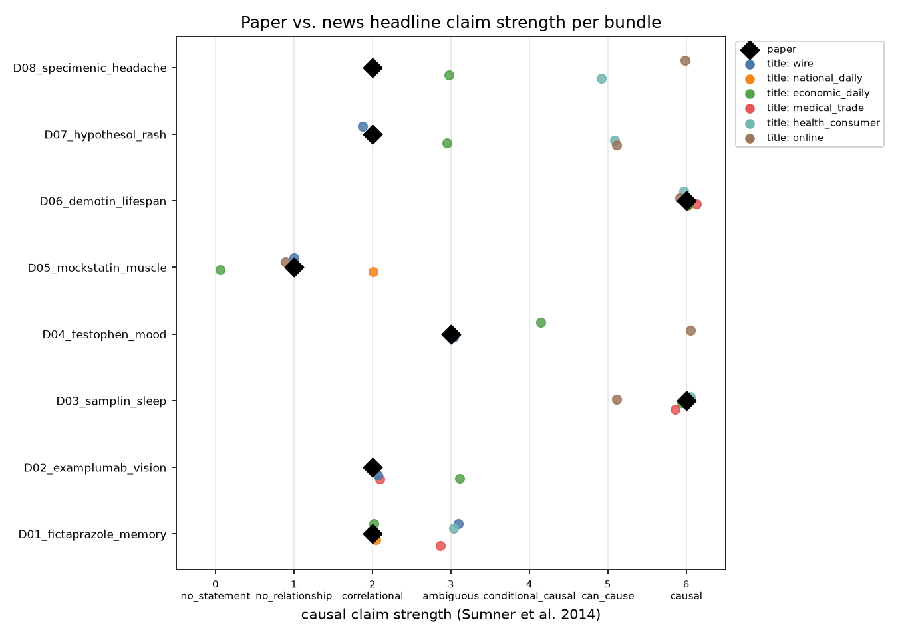
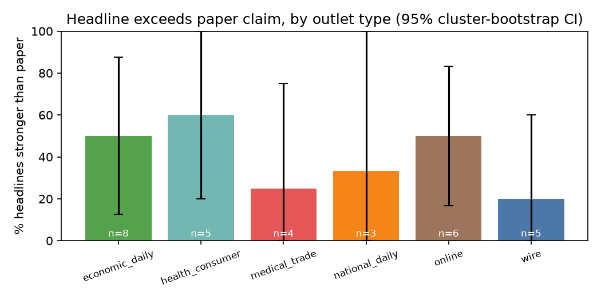
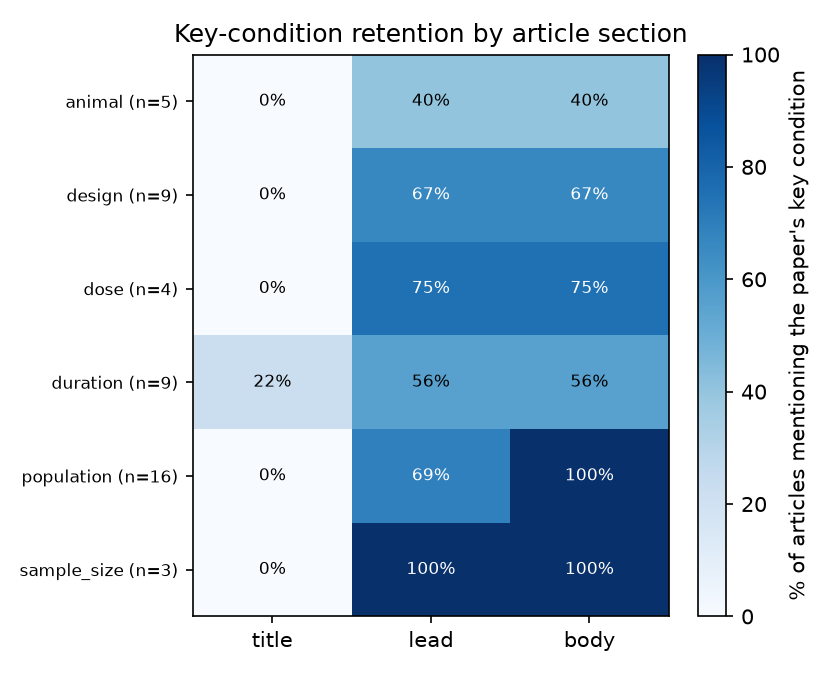
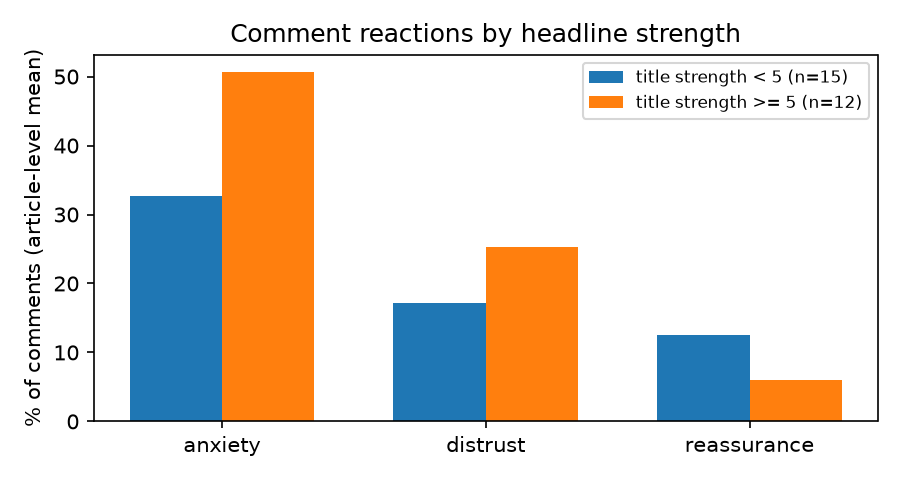

> **이 파일은 `python -m medclaim demo` 로 만든 합성(가짜) 데이터 리포트 예시입니다.** 실제 연구 결과가 아니며, 출력 형식을 보여주기 위한 것입니다.

# 결과 리포트 — 약물 부작용 연구의 온라인 전달 과정

_생성: 2026-10-01 10:50 · 기사 코드 출처: `final` · 논문 코드 출처: {'human': 8}_

> ⚠️ **합성(가짜) 데이터 데모입니다.** 약물·매체·기사·댓글이 모두 지어낸 것이며, 아래 수치는 파이프라인이 돌아가는지 보여줄 뿐 아무 의미가 없습니다.

## 0. 데이터 현황

- 묶음 8개 (목표 20~25) · 기사 31건 · 묶음당 기사 3~5건 (중앙값 4, 목표 3~5)
- 매체 유형: {'economic_daily': 8, 'online': 6, 'wire': 5, 'health_consumer': 5, 'medical_trade': 4, 'national_daily': 3}

## 1. 코딩 신뢰도

코더 간 일치도(Cohen's κ, 순서형은 선형 가중 κ)와 자동 사전 코딩 vs 사람 일치도.

| comparison | field | n | pct_agree | kappa | weighted_kappa |
|---|---|---|---|---|---|
| coder1 vs coder2 | title_strength | 13 | 69.2 | 0.606 | 0.78 |
| coder1 vs coder2 | lead_strength | 13 | 61.5 | -0.161 | -0.102 |
| coder1 vs coder2 | direction | 13 | 100.0 | 1.0 |  |
| coder1 vs coder2 | advice | 13 | 100.0 | 1.0 | 1.0 |
| coder1 vs coder2 | caveat_in_body | 13 | 100.0 | 1.0 |  |
| coder1 vs coder2 | title_omission_misleading | 13 | 84.6 | 0.567 |  |
| coder1 vs coder2 | animal_generalization | 0 |  |  |  |
| coder1 vs coder2 | source_error | 13 | 100.0 |  |  |
| auto vs coder1 | title_strength | 31 | 83.9 | 0.791 | 0.921 |
| auto vs coder1 | lead_strength | 31 | 87.1 | 0.541 | 0.554 |
| auto vs coder1 | direction | 31 | 100.0 | 1.0 |  |
| auto vs coder1 | advice | 31 | 100.0 | 1.0 | 1.0 |
| auto vs coder1 | caveat_in_body | 31 | 100.0 | 1.0 |  |
| auto vs coder2 | title_strength | 13 | 92.3 | 0.893 | 0.944 |
| auto vs coder2 | lead_strength | 13 | 69.2 | -0.13 | -0.083 |
| auto vs coder2 | direction | 13 | 100.0 | 1.0 |  |
| auto vs coder2 | advice | 13 | 100.0 | 1.0 | 1.0 |
| auto vs coder2 | caveat_in_body | 13 | 100.0 | 1.0 |  |

## 2. RQ1 — 논문의 '연관'이 기사 제목에서 '원인'으로 강화되는가

척도: 0=no_statement, 1=no_relationship, 2=correlational, 3=ambiguous, 4=conditional_causal, 5=can_cause, 6=causal

### 2-1. 전체 비율
| 지표 | 변수 | n(판단 가능) | 비율 [95% 묶음 부트스트랩 CI] |
|---|---|---|---|
| 제목이 논문보다 강함 | exceeds_title | 31 | 41.9% [19.0, 65.6] |
| 리드가 논문보다 강함 | exceeds_lead | 31 | 9.7% [2.8, 20.4] |
| 상관→인과 강화(관찰연구, 제목) | causal_inflation_title | 19 | 21.1% [0.0, 47.1] |
| 방향 불일치(증가/감소/무관) | direction_mismatch | 31 | 0.0% [0.0, 0.0] |
| 제목 강도 ≥5 (can/단정적 인과) | strong_title | 31 | 45.2% [16.4, 72.7] |
| 강한 제목 + 본문엔 주의 문장 | title_body_gap | 31 | 19.4% [6.1, 35.0] |

### 2-2. 매체 유형별
| outlet_type | 기사 수 | 묶음 수 | 제목 강도 평균 | Δ(제목−논문) 평균 | 제목이 논문보다 강함 | 강한 제목 + 본문엔 주의 문장 | 제목 강도 ≥5 (can/단정적 인과) | 선정 표현(제목) 평균 | 의문형 제목 % |
|---|---|---|---|---|---|---|---|---|---|
| economic_daily | 8 | 8 | 3.38 | 0.38 | 50.0% [12.5, 87.5] | 0.0% [0.0, 0.0] | 25.0% [0.0, 50.0] | 0.0 | 0.0 |
| online | 6 | 6 | 4.83 | 1.5 | 50.0% [16.7, 83.3] | 50.0% [16.7, 83.3] | 83.3% [50.0, 100.0] | 0.67 | 16.7 |
| health_consumer | 5 | 5 | 5.0 | 1.4 | 60.0% [20.0, 100.0] | 20.0% [0.0, 60.0] | 80.0% [40.0, 100.0] | 0.4 | 40.0 |
| wire | 5 | 5 | 2.2 | 0.2 | 20.0% [0.0, 60.0] | 0.0% [0.0, 0.0] | 0.0% [0.0, 0.0] | 0.0 | 0.0 |
| medical_trade | 4 | 4 | 4.25 | 0.25 | 25.0% [0.0, 75.0] | 50.0% [0.0, 100.0] | 50.0% [0.0, 100.0] | 0.5 | 0.0 |
| national_daily | 3 | 3 | 3.33 | 0.33 | 33.3% [0.0, 100.0] | 0.0% [0.0, 0.0] | 33.3% [0.0, 100.0] | 0.0 | 0.0 |

### 2-3. 묶음별 (논문 강도 vs 제목 강도 분포)
| bundle_id | 설계 | 논문 강도 | 보도자료 강도 | 기사 수 | 제목 강도 min | 제목 강도 max | 제목 강도 평균 | 제목 강도 SD | 논문보다 강한 제목 | 매체 유형 |
|---|---|---|---|---|---|---|---|---|---|---|
| D01_fictaprazole_memory | observational | 2 |  | 5 | 2 | 3 | 2.6 | 0.49 | 3 | economic_daily, health_consumer, medical_trade, national_daily, wire |
| D02_examplumab_vision | observational | 2 |  | 3 | 2 | 3 | 2.33 | 0.47 | 1 | economic_daily, medical_trade, wire |
| D03_samplin_sleep | rct | 6 |  | 4 | 5 | 6 | 5.75 | 0.43 | 0 | economic_daily, health_consumer, medical_trade, online |
| D04_testophen_mood | case_report | 3 |  | 3 | 3 | 6 | 4.33 | 1.25 | 2 | economic_daily, online, wire |
| D05_mockstatin_muscle | observational | 1 |  | 4 | 0 | 2 | 1.0 | 0.71 | 1 | economic_daily, national_daily, online, wire |
| D06_demotin_lifespan | animal | 6 |  | 5 | 6 | 6 | 6.0 | 0.0 | 0 | economic_daily, health_consumer, medical_trade, national_daily, online |
| D07_hypothesol_rash | observational | 2 |  | 4 | 2 | 5 | 3.75 | 1.3 | 3 | economic_daily, health_consumer, online, wire |
| D08_specimenic_headache | meta | 2 |  | 3 | 3 | 6 | 4.67 | 1.25 | 3 | economic_daily, health_consumer, online |

### 2-4. 제목 vs 리드
| n | 제목 > 리드 % | 제목 = 리드 % | 제목 < 리드 % | 평균 (제목−리드) |
|---|---|---|---|---|
| 31 | 71.0 | 19.4 | 9.7 | 1.9 |

### 2-6. GEE (제목>논문 ~ 매체 유형)
_GEE binomial, exchangeable, reference=economic_daily, n=31, 묶음=8_

| term | odds_ratio | ci_low | ci_high | p_value |
|---|---|---|---|---|
| Intercept | 1.0 | 0.25 | 3.998 | 1.0 |
| C(outlet_type, Treatment(reference='economic_daily'))[T.health_consumer] | 1.537 | 0.419 | 5.638 | 0.517 |
| C(outlet_type, Treatment(reference='economic_daily'))[T.online] | 1.119 | 0.469 | 2.668 | 0.7999 |
| C(outlet_type, Treatment(reference='economic_daily'))[T.other] | 0.645 | 0.105 | 3.967 | 0.6364 |
| C(outlet_type, Treatment(reference='economic_daily'))[T.wire] | 0.166 | 0.004 | 7.101 | 0.349 |

## 3. RQ2 — 연구 대상·용량·기간·한계가 제목에서 빠지는가

논문별 핵심 조건(paper_coding.csv 의 key_conditions)이 기사 구간에 언급됐는지(자동 탐지)의 비율(%).

| condition | n | 제목에_남음 | 리드에_남음 | 본문에_남음 | 제목에서만_빠짐 | 어디에도_없음 |
|---|---|---|---|---|---|---|
| animal | 5 | 0.0 | 40.0 | 40.0 | 40.0 | 60.0 |
| design | 9 | 0.0 | 66.7 | 66.7 | 66.7 | 33.3 |
| dose | 4 | 0.0 | 75.0 | 75.0 | 75.0 | 25.0 |
| duration | 9 | 22.2 | 55.6 | 55.6 | 44.4 | 33.3 |
| population | 16 | 0.0 | 68.8 | 100.0 | 100.0 | 0.0 |
| sample_size | 3 | 0.0 | 100.0 | 100.0 | 100.0 | 0.0 |

‘언급 여부’만 본 것이다. 4.4년 → ‘장기’처럼 뭉뚱그린 경우는 언급으로 잡히므로, 오해 유발 여부는 사람 코드(title_omission_misleading)로 따로 본다.

## 4. RQ3 — 단정적·조건 생략 제목 기사에서 댓글의 불안·불신이 더 많은가

댓글 406개 / 기사 28건 (기사당 5개 이상만 비교).

| 비교 | 반응 | 기사 수(있음/없음) | 있음 평균 % | 없음 평균 % | 차이 %p [95% CI] | Mann-Whitney p |
|---|---|---|---|---|---|---|
| 제목 강도 ≥5 | anxiety | 12/15 | 50.7 | 32.7 | 17.9 [10.9, 25.3] | 0.0027 |
| 제목 강도 ≥5 | distrust | 12/15 | 25.3 | 17.1 | 8.2 [1.7, 15.1] | 0.1427 |
| 제목 강도 ≥5 | reassurance | 12/15 | 6.0 | 12.6 | -6.5 [-14.3, 1.8] | 0.5177 |
| 제목이 논문보다 강함 | anxiety | 12/15 | 48.0 | 34.9 | 13.2 [0.9, 25.7] | 0.0479 |
| 제목이 논문보다 강함 | distrust | 12/15 | 21.8 | 19.9 | 1.9 [-6.4, 10.3] | 0.714 |
| 제목이 논문보다 강함 | reassurance | 12/15 | 4.3 | 13.9 | -9.6 [-19.1, -0.9] | 0.0169 |
| 제목 조건 생략이 오해 유발 | anxiety | 7/20 | 54.8 | 35.8 | 19.1 [7.5, 36.9] | 0.0186 |
| 제목 조건 생략이 오해 유발 | distrust | 7/20 | 25.2 | 19.2 | 6.0 [-4.7, 13.5] | 0.3754 |
| 제목 조건 생략이 오해 유발 | reassurance | 7/20 | 4.3 | 11.5 | -7.3 [-15.0, -0.7] | 0.1944 |

연관만 보여준다(기사→감정 인과 아님). 댓글은 네이버 인링크 기사에만 있어 일반지에 편중된다.

## 5. 텍스트마이닝

### 5-1. 제목 특유 표현 (로그오즈 z, A=제목 / B=본문)
| token | count_a | count_b | z | side |
|---|---|---|---|---|
| 찾다 | 6 | 0 | 3.05 | A |
| 장기 | 6 | 0 | 3.05 | A |
| 관련 | 6 | 0 | 3.05 | A |
| 연결 | 4 | 0 | 2.48 | A |
| 고리 | 4 | 0 | 2.48 | A |
| 충격 | 4 | 0 | 2.48 | A |
| 부르다 | 4 | 0 | 2.48 | A |
| 먹다 | 4 | 0 | 2.48 | A |
| 생기다 | 4 | 0 | 2.48 | A |
| 가상프라졸 | 5 | 10 | 2.31 | A |
| 기억력 | 5 | 10 | 2.31 | A |
| 저하 | 5 | 10 | 2.31 | A |
| 수명 | 5 | 10 | 2.31 | A |
| 단축 | 5 | 10 | 2.31 | A |
| 데모틴 | 5 | 10 | 2.31 | A |
| 연구 | 0 | 115 | -2.4 | B |
| 나타나다 | 0 | 62 | -1.73 | B |
| 집단 | 0 | 62 | -1.73 | B |
| 기사 | 0 | 62 | -1.73 | B |
| 결과 | 0 | 51 | -1.56 | B |
| 팀 | 0 | 50 | -1.54 | B |
| 비교 | 0 | 35 | -1.28 | B |
| 합성 | 0 | 31 | -1.2 | B |
| 예시 | 0 | 31 | -1.2 | B |
| 국제 | 0 | 31 | -1.2 | B |
| 학술지 | 0 | 31 | -1.2 | B |
| 가상의학저널 | 0 | 31 | -1.2 | B |
| 게재 | 0 | 31 | -1.2 | B |
| 않다 | 0 | 31 | -1.2 | B |
| 고령 | 0 | 31 | -1.2 | B |

### 5-2. 논문보다 강한 제목(A) vs 아닌 제목(B)
| token | count_a | count_b | z | side |
|---|---|---|---|---|
| 찾다 | 5 | 1 | 1.71 | A |
| 연결 | 4 | 0 | 1.62 | A |
| 고리 | 4 | 0 | 1.62 | A |
| 수 | 3 | 0 | 1.39 | A |
| 두통 | 3 | 0 | 1.39 | A |
| 견본산 | 3 | 0 | 1.39 | A |
| 가정솔 | 3 | 1 | 1.13 | A |
| 피부 | 3 | 1 | 1.13 | A |
| 발진 | 3 | 1 | 1.13 | A |
| 줄이다 | 2 | 0 | 1.13 | A |
| 테스트펜 | 2 | 1 | 0.74 | A |
| 우울감 | 2 | 1 | 0.74 | A |
| 있다 | 5 | 4 | 0.71 | A |
| 가상프라졸 | 3 | 2 | 0.7 | A |
| 기억력 | 3 | 2 | 0.7 | A |
| 수명 | 0 | 5 | -1.5 | B |
| 단축 | 0 | 5 | -1.5 | B |
| 데모틴 | 0 | 5 | -1.5 | B |
| 수면장애 | 0 | 4 | -1.34 | B |
| 샘플린 | 0 | 4 | -1.34 | B |
| 먹다 | 0 | 4 | -1.34 | B |
| 생기다 | 0 | 4 | -1.34 | B |
| 연관 | 0 | 3 | -1.15 | B |
| 없다 | 0 | 2 | -0.94 | B |
| 모의스타틴 | 1 | 3 | -0.68 | B |
| 근육통 | 1 | 3 | -0.68 | B |
| 충격 | 1 | 3 | -0.68 | B |
| 부르다 | 1 | 3 | -0.68 | B |
| 복용 | 3 | 6 | -0.58 | B |
| 장기 | 2 | 4 | -0.46 | B |

### 5-3. 매체 유형별 TF-IDF 상위어 (제목+리드)
| group | n_docs | top_terms |
|---|---|---|
| economic_daily | 8 | 연구(0.129), 결과(0.114), 위험(0.109), 최근(0.086), 복용군(0.085), 나타나다(0.084), 높다(0.083), 찾다(0.082), 게재(0.081), 국제(0.081) |
| health_consumer | 5 | 결과(0.117), 두통(0.114), 견본산(0.114), 연구(0.114), 수(0.101), 데모틴(0.097), 수명(0.097), 단축(0.097), 복용군(0.095), 위험(0.095) |
| medical_trade | 4 | 이상(0.141), 결과(0.134), 시력(0.112), 예시맙(0.112), 샘플린(0.111), 수면장애(0.111), 분석(0.109), 수명(0.108), 단축(0.108), 데모틴(0.108) |
| national_daily | 3 | 데모틴(0.161), 단축(0.161), 수명(0.161), 연구(0.160), 저하(0.160), 가상프라졸(0.160), 기억력(0.160), 복용(0.155), 모의스타틴(0.147), 근육통(0.147) |
| online | 6 | 연구(0.147), 결과(0.126), 위험(0.118), 두통(0.096), 견본산(0.096), 국제(0.095), 학술지(0.095), 게재(0.095), 가상의학저널(0.095), 최근(0.093) |
| wire | 5 | 복용(0.171), 이상(0.169), 결과(0.153), 분석(0.130), 연구(0.117), 관련(0.113), 장기(0.113), 테스트펜(0.105), 우울감(0.105), 있다(0.097) |

### 5-4. 약물 언급 문장의 공기어 (PMI)
| token | co_count | token_count | pmi |
|---|---|---|---|
| 비교 | 35 | 35 | 1.294 |
| 위험 | 33 | 33 | 1.294 |
| 예시 | 31 | 31 | 1.294 |
| 합성 | 31 | 31 | 1.294 |
| 않다 | 31 | 31 | 1.294 |
| 집단 | 31 | 31 | 1.294 |
| 높다 | 23 | 23 | 1.294 |
| 분석 | 20 | 20 | 1.294 |
| 복용군 | 20 | 20 | 1.294 |
| 배 | 16 | 16 | 1.294 |
| 최근 | 11 | 11 | 1.294 |
| 연관 | 7 | 7 | 1.294 |
| 찾다 | 6 | 6 | 1.294 |
| 코호트 | 6 | 6 | 1.294 |
| 성인 | 6 | 6 | 1.294 |
| 장기 | 6 | 6 | 1.294 |
| 관련 | 6 | 6 | 1.294 |
| 환자 | 5 | 5 | 1.294 |
| 고리 | 4 | 4 | 1.294 |
| 연결 | 4 | 4 | 1.294 |
| 부르다 | 4 | 4 | 1.294 |
| 생기다 | 4 | 4 | 1.294 |
| 먹다 | 4 | 4 | 1.294 |
| 노인 | 4 | 4 | 1.294 |
| 형제 | 4 | 4 | 1.294 |

### 5-5. 댓글 LDA 토픽
| topic | share | top_terms | representative |
|---|---|---|---|
| 0 | 0.232 | 끊다, 걱정, 기레기, 또, 과장, 기사, 못, 믿다, 다행, 먹다 | 기레기 또 과장하네 |
| 1 | 0.239 | 먹다, 엄마, 어떡하다, 아니다, 제약사, 광고, 다행, 상관없다, 기사, 보다 | 제약사 광고 아님? |
| 2 | 0.281 | 있다, 무섭다, 먹다, 잘, 기사, 보다, 링크, 논문, 없다, 원문 | 논문 원문 링크는 없나요 |
| 3 | 0.132 | 보다, 의사, 상담, 안심, 괜찮다, 기사, 다행, 먹다, 잘, 상관없다 | 의사랑 상담해봐야겠네 |
| 4 | 0.116 | 궁금, 연구, 다행, 기사, 먹다, 보다, 상관없다, 잘, 걱정, 끊다 | 다른 연구도 궁금하네 |

## 6. (탐색) Naive Bayes 분류
_GroupKFold(n_splits=5, 묶음 단위), n=31, 양성 비율=0.42_

| model | accuracy | macro_F1 |
|---|---|---|
| MultinomialNB (TF-IDF, Kiwi 토큰) | 0.323 | 0.296 |
| 다수 클래스 기준선 | 0.581 | 0.367 |

## 7. 해석 시 주의

- 같은 논문의 기사들은 독립이 아니다 → 묶음 단위 부트스트랩 CI를 같이 본다.
- '논문보다 강하다' = 원논문 대비 상대 판정이다. 원논문 자체의 과장은 잡지 못한다.
- 조건 미언급 ≠ 오해 유발. 제목에 모든 조건을 넣을 수는 없다.
- 자세한 한계는 LIMITATIONS.md 참고.
