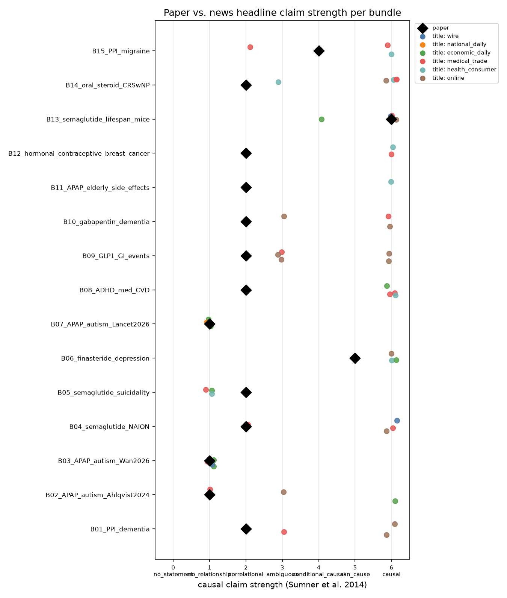
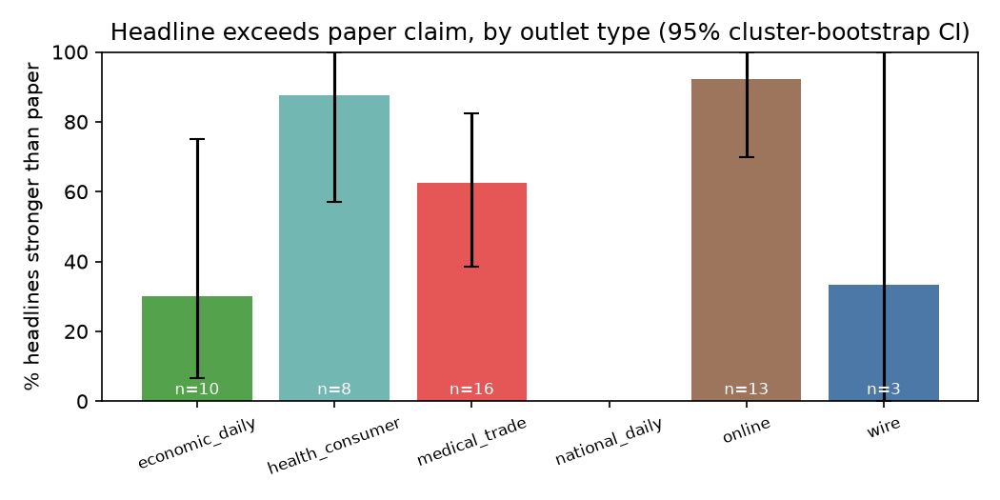
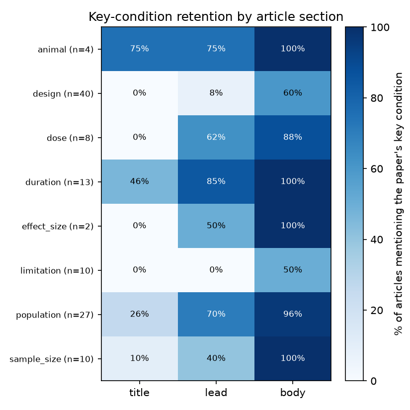

# 결과 리포트 — 약물 부작용 연구의 온라인 전달 과정

_생성: 2026-10-02 06:22 · 기사 코드 출처: `final` (코더: claude) · 논문 코드: {'coded': 15} (확인: claude (초록 결론 기준, 파일럿), claude (초록 결론 기준, 확장))_

> ℹ️ 이 리포트의 코딩은 LLM(Claude)이 코드북에 따라 본문을 읽고 매긴 **단일 코더** 값입니다. 사람 코더가 일부(20~30%)를 독립 코딩해 κ 로 검증하기 전까지는 예비 결과로만 쓰세요.

## 0. 데이터 현황

- 묶음 15개 (목표 20~25) · 기사 51건 · 묶음당 기사 1~5건 (중앙값 3, 목표 3~5)
- ⚠️ 기사 3건 미만 묶음: B11_APAP_elderly_side_effects, B12_hormonal_contraceptive_breast_cancer → 매체 간 비교에서 제외 고려
- 매체 유형: {'medical_trade': 16, 'online': 13, 'economic_daily': 10, 'health_consumer': 8, 'wire': 3, 'national_daily': 1}

### 0-1. 실행 가능성 점검 (파일럿)

기준은 잠정값입니다. 숫자보다 '어디가 병목인지'를 보세요.

| 점검 항목 | 값 | 기준(잠정) | 판정 | 의미 |
|---|---|---|---|---|
| 기사 3건 이상 묶음 | 13/15개 (B01=3, B02=3, B03=4, B04=4, B05=3, B06=3, B07=4, B08=4, B09=5, B10=3, B11=1, B12=2, B13=4, B14=5, B15=3) | 묶음의 70% 이상 | ✅ 충족 | 20~25개 묶음을 채울 수 있는지. 미달 묶음은 검색 보강(네이버 API·BigKinds) 또는 교체 |
| 후보 기사 중 '그 논문 보도' 비율 | 77% (53/69; 배경 인용 4, 다른 논문·기타 11) | 참고 지표 | – | 낮을수록 사람(또는 LLM)의 연결 판정이 필수. 키워드 검색만으로 묶음을 만들면 다른 논문 기사가 섞임 |
| 제목 강도 ≠ 논문 강도 비율 | 75% (n=51) | 30% 이상 | ✅ 충족 | 0%면 '제목이 바뀌는가'를 물을 변량이 없음 |
| 묶음 내 제목 강도 표준편차(평균) | 0.80 | 0.5 이상 | ✅ 충족 | 같은 논문을 매체마다 다르게 쓰는지(매체 간 비교 가능성) |
| 제목이 논문보다 강한 비율 | 65% | 참고 지표 | – | RQ1의 핵심 수치 |
| 핵심 조건이 본문엔 있고 제목엔 없는 비율 | 65% (기사×조건 114쌍) | 참고 지표 | – | RQ2. 자동 탐지값이라 사람 판정(title_omission_misleading)과 함께 볼 것 |
| 제목 조건 생략이 오해를 부른다(사람 판정) | 41% (n=51) | 참고 지표 | – | RQ2를 사람 판단으로 본 값 |
| 자동 사전 vs 코더 (제목 강도, 가중 κ) | 0.52 | 0.6 이상 | ⚠️ 미달 | 충족하면 규모를 키울 때 자동 사전이 1차 분류를 대신할 수 있음 |
| 자동 사전이 약한 항목 | advice | κ<0.4 | ⚠️ 미달 | 이 항목은 사람/LLM 코딩이 필요 |
| 출처 표기 오류(저널·데이터·주체) | 12% (n=51) | 참고 지표 | – | 새 코딩 항목으로 쓸 만한지 |
| 댓글 5개 이상 기사 | 미수집 | 50% 이상 | – | RQ3 가능 여부. 의약전문지 기사는 대부분 댓글이 없음 |

## 1. 코딩 신뢰도

코더 간 일치도(Cohen's κ, 순서형은 선형 가중 κ)와 자동 사전 코딩 vs 사람 일치도.

| comparison | field | n | pct_agree | kappa | weighted_kappa |
|---|---|---|---|---|---|
| auto vs claude | title_strength | 51 | 68.6 | 0.552 | 0.516 |
| auto vs claude | lead_strength | 51 | 60.8 | 0.522 | 0.515 |
| auto vs claude | direction | 43 | 83.7 | 0.601 |  |
| auto vs claude | advice | 51 | 35.3 | 0.08 | 0.127 |
| auto vs claude | caveat_in_body | 51 | 86.3 | 0.724 |  |

## 2. RQ1 — 논문의 '연관'이 기사 제목에서 '원인'으로 강화되는가

척도: 0=no_statement, 1=no_relationship, 2=correlational, 3=ambiguous, 4=conditional_causal, 5=can_cause, 6=causal

### 2-1. 전체 비율
| 지표 | 변수 | n(판단 가능) | 비율 [95% 묶음 부트스트랩 CI] |
|---|---|---|---|
| 제목이 논문보다 강함 | exceeds_title | 51 | 64.7% [39.6, 86.5] |
| 리드가 논문보다 강함 | exceeds_lead | 51 | 43.1% [20.8, 64.8] |
| 상관→인과 강화(관찰연구, 제목) | causal_inflation_title | 37 | 56.8% [35.1, 76.5] |
| 방향 불일치(증가/감소/무관) | direction_mismatch | 51 | 5.9% [0.0, 19.6] |
| 제목 강도 ≥5 (can/단정적 인과) | strong_title | 51 | 56.9% [38.0, 74.4] |
| 강한 제목 + 본문엔 주의 문장 | title_body_gap | 51 | 31.4% [18.3, 46.7] |

### 2-2. 매체 유형별
| outlet_type | 기사 수 | 묶음 수 | 제목 강도 평균 | Δ(제목−논문) 평균 | 제목이 논문보다 강함 | 강한 제목 + 본문엔 주의 문장 | 제목 강도 ≥5 (can/단정적 인과) | 선정 표현(제목) 평균 | 의문형 제목 % |
|---|---|---|---|---|---|---|---|---|---|
| medical_trade | 16 | 12 | 4.19 | 1.81 | 62.5% [38.5, 82.4] | 31.2% [12.5, 50.0] | 56.2% [30.8, 76.5] | 0.06 | 25.0 |
| online | 13 | 8 | 5.08 | 2.62 | 92.3% [70.0, 100.0] | 30.8% [11.1, 60.0] | 69.2% [50.0, 90.9] | 0.08 | 23.1 |
| economic_daily | 10 | 7 | 2.8 | 0.7 | 30.0% [6.7, 75.0] | 20.0% [0.0, 57.1] | 30.0% [6.7, 75.0] | 0.1 | 30.0 |
| health_consumer | 8 | 7 | 5.0 | 2.38 | 87.5% [57.1, 100.0] | 37.5% [10.0, 85.7] | 75.0% [50.0, 100.0] | 0.0 | 37.5 |
| wire | 3 | 3 | 4.33 | 1.33 | 33.3% [0.0, 100.0] | 66.7% [0.0, 100.0] | 66.7% [0.0, 100.0] | 0.0 | 66.7 |
| national_daily | 1 | 1 | 1.0 | 0.0 | 0.0% | 0.0% | 0.0% | 1.0 | 0.0 |

### 2-3. 묶음별 (논문 강도 vs 제목 강도 분포)
| bundle_id | 설계 | 논문 강도 | 보도자료 강도 | 기사 수 | 제목 강도 min | 제목 강도 max | 제목 강도 평균 | 제목 강도 SD | 논문보다 강한 제목 | 매체 유형 |
|---|---|---|---|---|---|---|---|---|---|---|
| B01_PPI_dementia | observational | 2 |  | 3 | 3 | 6 | 5.0 | 1.41 | 3 | medical_trade, online |
| B02_APAP_autism_Ahlqvist2024 | observational | 1 |  | 3 | 1 | 6 | 3.33 | 2.05 | 2 | economic_daily, medical_trade, online |
| B03_APAP_autism_Wan2026 | observational | 1 |  | 4 | 1 | 1 | 1.0 | 0.0 | 0 | economic_daily, medical_trade, wire |
| B04_semaglutide_NAION | observational | 2 |  | 4 | 2 | 6 | 5.0 | 1.73 | 3 | medical_trade, online, wire |
| B05_semaglutide_suicidality | observational | 2 |  | 3 | 1 | 1 | 1.0 | 0.0 | 0 | economic_daily, health_consumer, medical_trade |
| B06_finasteride_depression | review | 5 |  | 3 | 6 | 6 | 6.0 | 0.0 | 3 | economic_daily, health_consumer, online |
| B07_APAP_autism_Lancet2026 | meta | 1 |  | 4 | 1 | 1 | 1.0 | 0.0 | 0 | economic_daily, national_daily |
| B08_ADHD_med_CVD | observational | 2 |  | 4 | 6 | 6 | 6.0 | 0.0 | 4 | economic_daily, health_consumer, medical_trade |
| B09_GLP1_GI_events | observational | 2 |  | 5 | 3 | 6 | 4.2 | 1.47 | 5 | medical_trade, online |
| B10_gabapentin_dementia | observational | 2 |  | 3 | 3 | 6 | 5.0 | 1.41 | 3 | medical_trade, online |
| B11_APAP_elderly_side_effects | observational | 2 |  | 1 | 6 | 6 | 6.0 | 0.0 | 1 | health_consumer |
| B12_hormonal_contraceptive_breast_cancer | observational | 2 |  | 2 | 6 | 6 | 6.0 | 0.0 | 2 | health_consumer, medical_trade |
| B13_semaglutide_lifespan_mice | animal | 6 |  | 4 | 4 | 6 | 5.5 | 0.87 | 0 | economic_daily, medical_trade, online, wire |
| B14_oral_steroid_CRSwNP | observational | 2 |  | 5 | 3 | 6 | 5.4 | 1.2 | 5 | health_consumer, medical_trade, online |
| B15_PPI_migraine | observational | 4 |  | 3 | 2 | 6 | 4.67 | 1.89 | 2 | health_consumer, medical_trade |

### 2-4. 제목 vs 리드
| n | 제목 > 리드 % | 제목 = 리드 % | 제목 < 리드 % | 평균 (제목−리드) |
|---|---|---|---|---|
| 51 | 37.3 | 51.0 | 11.8 | 0.75 |

### 2-6. GEE (제목>논문 ~ 매체 유형)
_GEE binomial, exchangeable, reference=medical_trade, n=51, 묶음=15_

| term | odds_ratio | ci_low | ci_high | p_value |
|---|---|---|---|---|
| Intercept | 1.281 | 0.482 | 3.406 | 0.6202 |
| C(outlet_type, Treatment(reference='medical_trade'))[T.economic_daily] | 1.623 | 0.627 | 4.196 | 0.3181 |
| C(outlet_type, Treatment(reference='medical_trade'))[T.health_consumer] | 2.124 | 1.036 | 4.357 | 0.0398 |
| C(outlet_type, Treatment(reference='medical_trade'))[T.online] | 2.447 | 1.091 | 5.491 | 0.03 |
| C(outlet_type, Treatment(reference='medical_trade'))[T.other] | 1.729 | 0.582 | 5.14 | 0.3243 |

## 3. RQ2 — 연구 대상·용량·기간·한계가 제목에서 빠지는가

논문별 핵심 조건(paper_coding.csv 의 key_conditions)이 기사 구간에 언급됐는지(자동 탐지)의 비율(%).

| condition | n | 제목에_남음 | 리드에_남음 | 본문에_남음 | 제목에서만_빠짐 | 어디에도_없음 |
|---|---|---|---|---|---|---|
| animal | 4 | 75.0 | 75.0 | 100.0 | 25.0 | 0.0 |
| design | 40 | 0.0 | 7.5 | 60.0 | 60.0 | 40.0 |
| dose | 8 | 0.0 | 62.5 | 87.5 | 87.5 | 12.5 |
| duration | 13 | 46.2 | 84.6 | 100.0 | 53.8 | 0.0 |
| effect_size | 2 | 0.0 | 50.0 | 100.0 | 100.0 | 0.0 |
| limitation | 10 | 0.0 | 0.0 | 50.0 | 50.0 | 50.0 |
| population | 27 | 25.9 | 70.4 | 96.3 | 70.4 | 3.7 |
| sample_size | 10 | 10.0 | 40.0 | 100.0 | 90.0 | 0.0 |

‘언급 여부’만 본 것이다. 4.4년 → ‘장기’처럼 뭉뚱그린 경우는 언급으로 잡히므로, 오해 유발 여부는 사람 코드(title_omission_misleading)로 따로 본다.

## 4. RQ3 — 단정적·조건 생략 제목 기사에서 댓글의 불안·불신이 더 많은가

_(댓글 데이터 없음 — `medclaim collect-comments` 필요)_

## 5. 텍스트마이닝

### 5-1. 제목 특유 표현 (로그오즈 z, A=제목 / B=본문)
| token | count_a | count_b | z | side |
|---|---|---|---|---|
| 자폐 | 9 | 23 | 3.97 | A |
| 타이레놀 | 10 | 40 | 3.5 | A |
| 비만약 | 4 | 2 | 3.49 | A |
| 위험 | 31 | 338 | 3.33 | A |
| 넘다 | 6 | 16 | 3.19 | A |
| 높이다 | 9 | 43 | 3.04 | A |
| 실명 | 3 | 3 | 2.87 | A |
| 장기 | 7 | 31 | 2.78 | A |
| 살 | 3 | 4 | 2.73 | A |
| 빼다 | 3 | 4 | 2.73 | A |
| 오젬픽 | 7 | 34 | 2.66 | A |
| 위고비 | 8 | 46 | 2.59 | A |
| 무관 | 2 | 2 | 2.34 | A |
| 아프다 | 2 | 2 | 2.34 | A |
| 커지다 | 3 | 8 | 2.25 | A |
| 있다 | 0 | 298 | -1.39 | B |
| 사용 | 0 | 155 | -0.99 | B |
| 약물 | 0 | 150 | -0.98 | B |
| 처방 | 0 | 128 | -0.9 | B |
| 연구 | 5 | 386 | -0.84 | B |
| 팀 | 0 | 103 | -0.81 | B |
| 환자 | 1 | 159 | -0.78 | B |
| 수 | 1 | 150 | -0.74 | B |
| 및 | 0 | 76 | -0.69 | B |
| 대하다 | 0 | 72 | -0.67 | B |
| 발생 | 0 | 70 | -0.67 | B |
| 나타나다 | 0 | 68 | -0.66 | B |
| 결과 | 2 | 184 | -0.65 | B |
| 교수 | 0 | 61 | -0.62 | B |
| 경우 | 0 | 59 | -0.61 | B |

### 5-2. 논문보다 강한 제목(A) vs 아닌 제목(B)
| token | count_a | count_b | z | side |
|---|---|---|---|---|
| 치료제 | 8 | 0 | 1.61 | A |
| 장기 | 7 | 0 | 1.5 | A |
| 치매 | 6 | 0 | 1.39 | A |
| 부작용 | 5 | 0 | 1.27 | A |
| 질환 | 5 | 0 | 1.27 | A |
| 먹다 | 5 | 0 | 1.27 | A |
| 스테로이드 | 5 | 0 | 1.27 | A |
| 만성 | 4 | 0 | 1.13 | A |
| 부비동 | 4 | 0 | 1.13 | A |
| 염 | 4 | 0 | 1.13 | A |
| 배 | 3 | 0 | 0.98 | A |
| 커지다 | 3 | 0 | 0.98 | A |
| 살 | 3 | 0 | 0.98 | A |
| 빼다 | 3 | 0 | 0.98 | A |
| 약제 | 3 | 0 | 0.98 | A |
| 타이레놀 | 2 | 8 | -2.52 | B |
| 임신 | 2 | 7 | -2.3 | B |
| 자폐 | 2 | 7 | -2.3 | B |
| 없다 | 0 | 5 | -2.01 | B |
| 연관 | 0 | 4 | -1.79 | B |
| 트럼프 | 0 | 3 | -1.55 | B |
| 위고비 | 3 | 5 | -1.49 | B |
| 자폐증 | 0 | 2 | -1.26 | B |
| 논란 | 0 | 2 | -1.26 | B |
| 않다 | 0 | 2 | -1.26 | B |
| 당뇨 | 0 | 2 | -1.26 | B |
| 무관 | 0 | 2 | -1.26 | B |
| 주장 | 0 | 2 | -1.26 | B |
| 반박 | 0 | 2 | -1.26 | B |
| 노화 | 0 | 2 | -1.26 | B |

### 5-3. 매체 유형별 TF-IDF 상위어 (제목+리드)
| group | n_docs | top_terms |
|---|---|---|
| economic_daily | 10 | 임신(0.143), 타이레놀(0.129), adhd(0.107), 자폐(0.103), 자녀(0.076), 나오다(0.075), 연구(0.073), 아세트아미노펜(0.069), 복용(0.069), 없다(0.068) |
| health_consumer | 8 | 위험(0.076), 스테로이드(0.076), 부비동(0.076), 염(0.076), 먹다(0.074), 부작용(0.073), 환자(0.072), 만성(0.069), 여성(0.068), 약물(0.065) |
| medical_trade | 16 | 위험(0.120), 복용(0.096), 증가(0.082), 있다(0.069), 결과(0.066), 편두통(0.065), 연구(0.061), adhd(0.057), 세마글루타이드(0.054), 치매(0.053) |
| national_daily | 1 | 트럼프(0.515), 대통령(0.366), 타이레놀(0.253), 경고(0.198), 정면(0.198), 보다(0.198), 지난해(0.198), 자폐증(0.183), 도널드(0.183), 있다(0.182) |
| online | 13 | 치매(0.094), 위험(0.088), 비만치료제(0.087), 약(0.080), 있다(0.079), 췌장염(0.078), 위고비(0.074), 치료제(0.074), 심각(0.071), 연구(0.071) |
| wire | 3 | 위고비(0.147), 연구(0.130), 비만(0.123), 맞다(0.122), jama(0.119), 연장(0.114), 있다(0.112), 결과(0.111), 자녀(0.108), 의대(0.107) |

### 5-4. 약물 언급 문장의 공기어 (PMI)
| token | co_count | token_count | pmi |
|---|---|---|---|
| 을 | 28 | 28 | 1.031 |
| 제제 | 23 | 23 | 1.031 |
| 은 | 19 | 19 | 1.031 |
| 과 | 18 | 18 | 1.031 |
| 이어 | 14 | 14 | 1.031 |
| 약제 | 14 | 14 | 1.031 |
| 의 | 13 | 13 | 1.031 |
| 덧붙이다 | 12 | 12 | 1.031 |
| 로 | 11 | 11 | 1.031 |
| 날트렉손 | 11 | 11 | 1.031 |
| 인 | 10 | 10 | 1.031 |
| 중증 | 9 | 9 | 1.031 |
| 기타 | 8 | 8 | 1.031 |
| 해열 | 8 | 8 | 1.031 |
| 투약 | 8 | 8 | 1.031 |
| 작용제 | 8 | 8 | 1.031 |
| 콘트라브 | 8 | 8 | 1.031 |
| 복합 | 8 | 8 | 1.031 |
| 이하 | 7 | 7 | 1.031 |
| 널리 | 7 | 7 | 1.031 |
| 흔히 | 7 | 7 | 1.031 |
| 허가 | 7 | 7 | 1.031 |
| 비율 | 7 | 7 | 1.031 |
| 자폐아 | 7 | 7 | 1.031 |
| 리라글루타이드 | 7 | 7 | 1.031 |

### 5-5. 댓글 LDA 토픽
_(결과 없음)_

## 6. (탐색) Naive Bayes 분류
_GroupKFold(n_splits=5, 묶음 단위), n=51, 양성 비율=0.65_

| model | accuracy | macro_F1 |
|---|---|---|
| MultinomialNB (TF-IDF, Kiwi 토큰) | 0.549 | 0.391 |
| 다수 클래스 기준선 | 0.647 | 0.393 |

## 7. 해석 시 주의

- 같은 논문의 기사들은 독립이 아니다 → 묶음 단위 부트스트랩 CI를 같이 본다.
- '논문보다 강하다' = 원논문 대비 상대 판정이다. 원논문 자체의 과장은 잡지 못한다.
- 조건 미언급 ≠ 오해 유발. 제목에 모든 조건을 넣을 수는 없다.
- 자세한 한계는 LIMITATIONS.md 참고.
